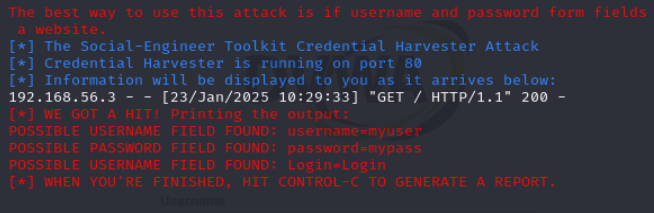

# Phishing para captura de senhas do Facebook

### Objetivos

- Com intuito didático, temos como objetivo obter as senhas de usuário da rede social Facebook através da tecnica de phishing. Para isso, será utilizado a ferramenta ```settoolkit ```disponivel na distribuição ```Kali Linux ```. Iremos clonar a página de login oficial do Facebook, que estára disponível localmente e que irá coletar as credenciais inseridas pelo usuário e poderão ser visualizadas pelo log.

### Ferramentas

- Kali Linux
- setoolkit

### Configurando o Phishing no Kali Linux

- Garantir o acesso como root: ``` sudo su ```
- Iniciando o setoolkit: ``` setoolkit ```
- Selecionar o tipo de ataque (opção 1): ``` Social-Engineering Attacks ```
- Selecionar o vetor de ataque (opção 2): ``` Web Site Attack Vectors ```
- Selecionar o método de ataque (opção 3): ```Credential Harvester Attack Method ```
- Selecionar o método de ataque (opção 2): ``` Site Cloner ```
  - Definir o IP do host que receberá as solicitações dos usuários.
  Nota: Utilize o seguinte comando para obter o endereço da máquina: ``` ifconfig ```
  - Definir qual site será clonado. Nesse caso será a URL: ```http://www.facebook.com ```
-  Executar no computador do usuário usando o IP definido no passo 6.1
-  Verificar os logs no Kali Linix (setoolkit)

### Resultados


